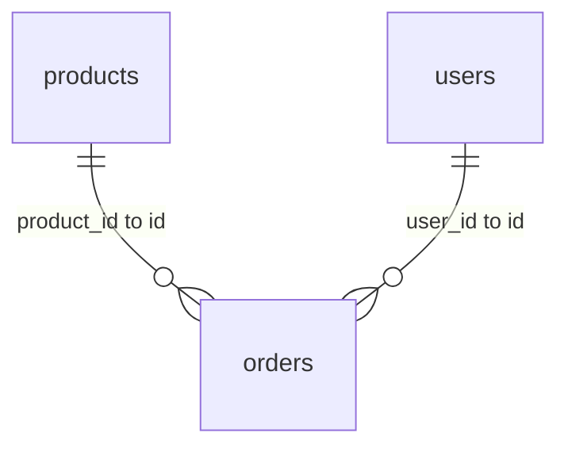

# 📁 Data Catalog for fixture

## 🚀 Entity Relationship Diagram (ERD)

## 🔎 Views

No views found in this database.

## 🗂️ Tables

### 📄 Table: `users`

**AI-Generated Summary:**
> This is an AI-generated table summary.

| Column Name | Data Type | AI-Generated Description |
| :--- | :--- | :--- |
| 🔑 `id` | `INTEGER` | This is an AI-generated description. |
| `name` | `TEXT` | This is an AI-generated description. |
| `email` | `TEXT` | This is an AI-generated description. |

### 📄 Table: `products`

**AI-Generated Summary:**
> This is an AI-generated table summary.

| Column Name | Data Type | AI-Generated Description |
| :--- | :--- | :--- |
| 🔑 `id` | `INTEGER` | This is an AI-generated description. |
| `name` | `TEXT` | This is an AI-generated description. |
| `price` | `REAL` | This is an AI-generated description. |

### 📄 Table: `orders`

**AI-Generated Summary:**
> This is an AI-generated table summary.

| Column Name | Data Type | AI-Generated Description |
| :--- | :--- | :--- |
| 🔑 `id` | `INTEGER` | This is an AI-generated description. |
| `user_id` | `INTEGER` | This is an AI-generated description. |
| `product_id` | `INTEGER` | This is an AI-generated description. |
| `order_date` | `TEXT` | This is an AI-generated description. |

